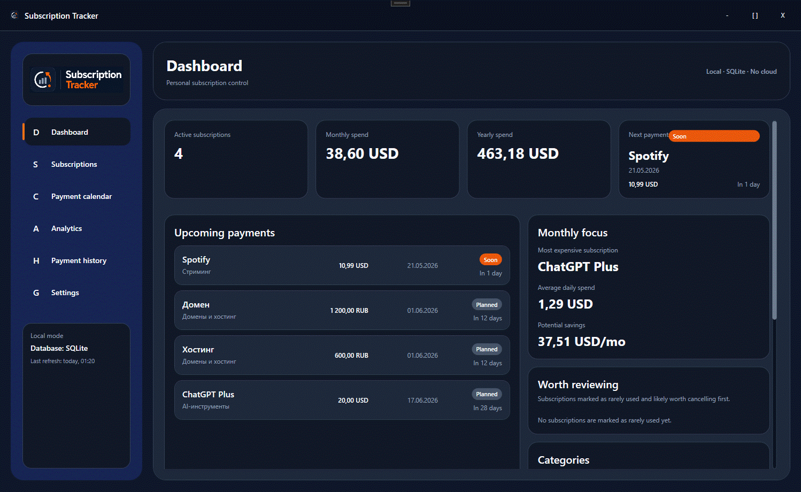
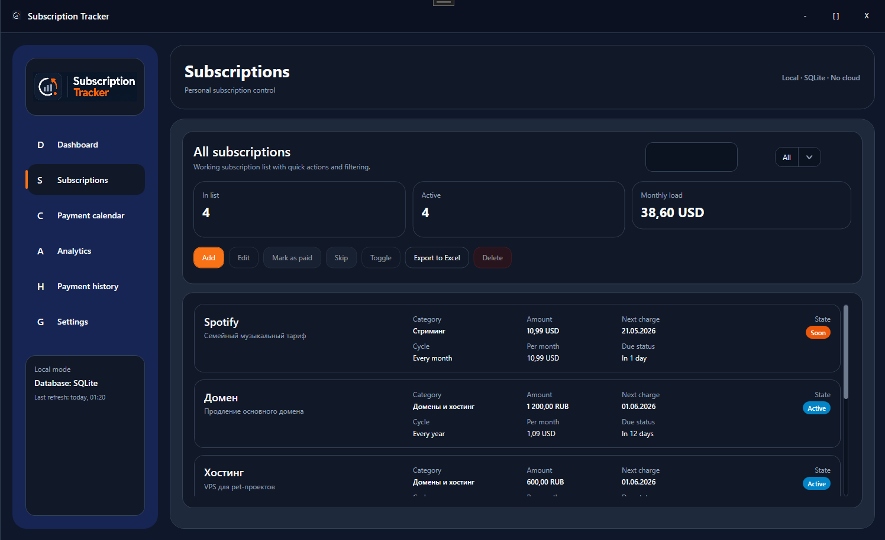
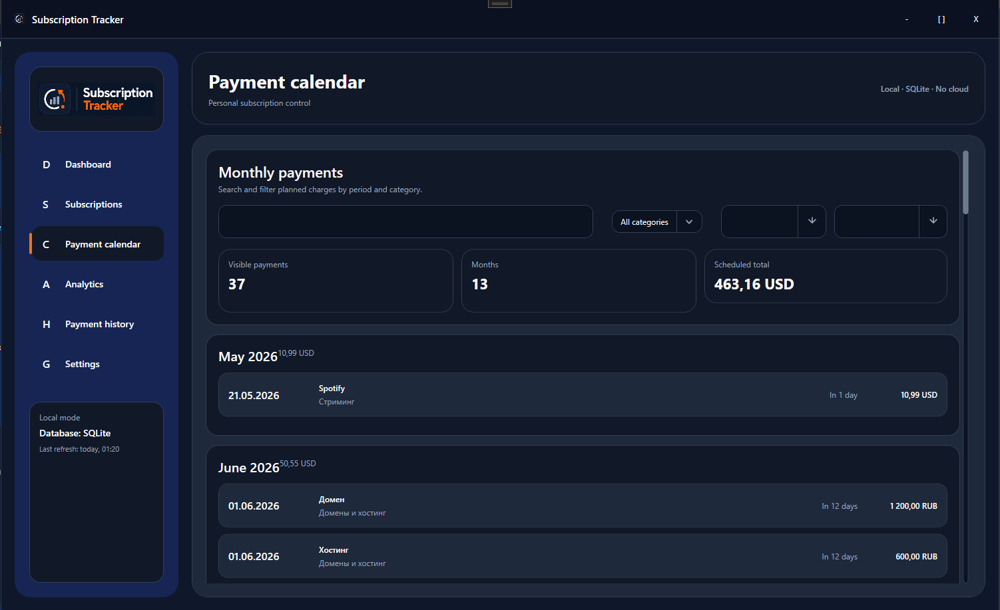
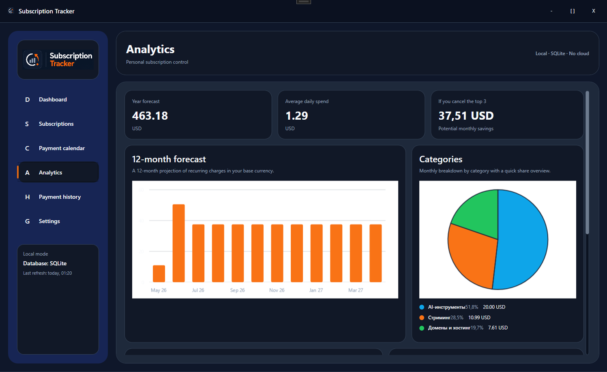
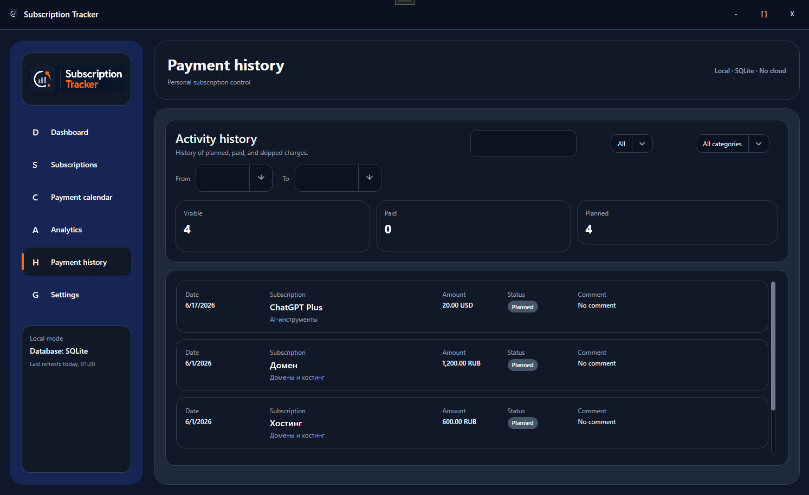
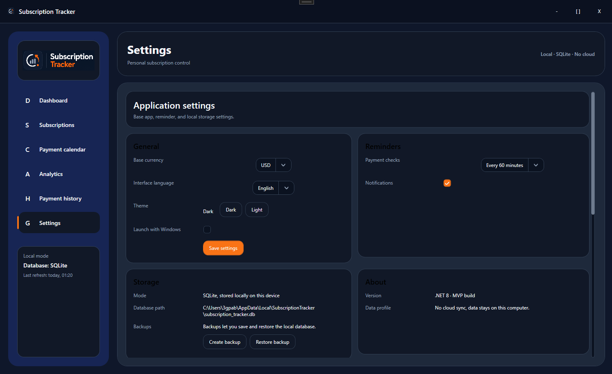
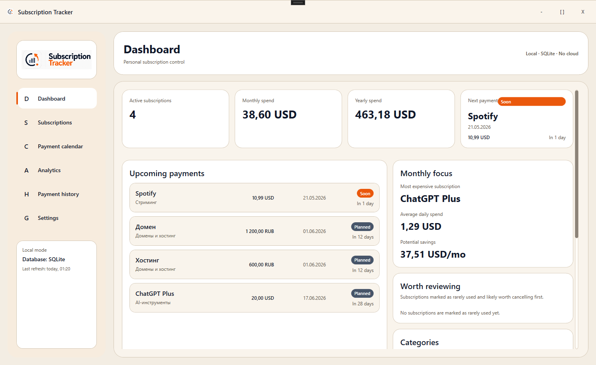
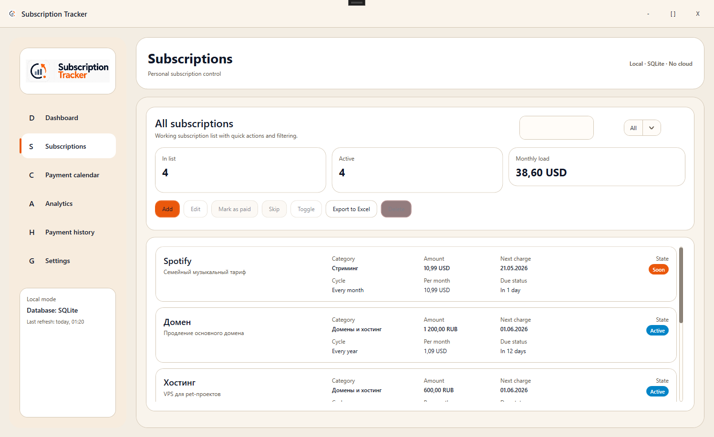
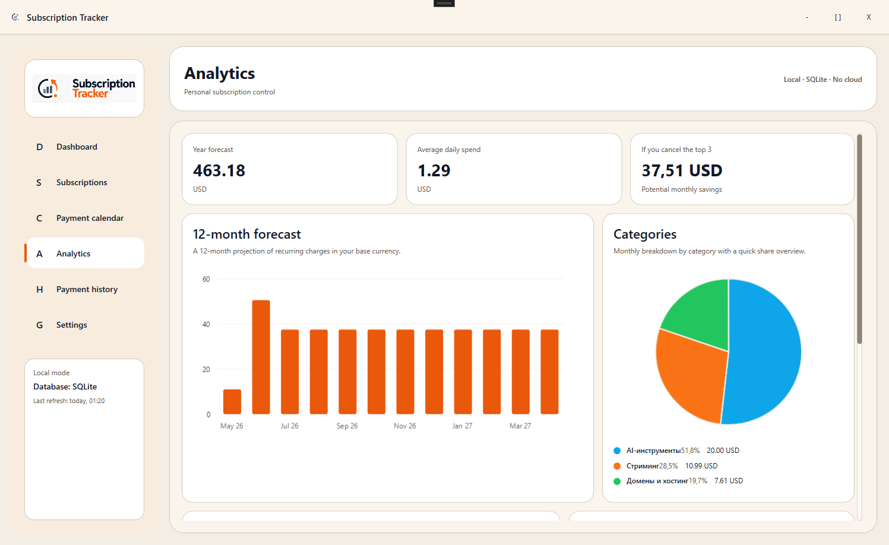

# Subscription Tracker


Subscription Tracker is a local-first desktop application for tracking recurring expenses such as subscriptions, domains, hosting, VPN services, loans, and installment payments.

The project is built as a real WPF product MVP rather than a demo CRUD app: it includes layered architecture, SQLite persistence, analytics, reminders, export, backup/restore, localization, theming, and custom desktop UX.

## Highlights

- Local-only storage with `SQLite`
- Clean layered architecture: `Wpf / Application / Domain / Infrastructure / Tests`
- Dashboard with key metrics, upcoming charges, category breakdown, savings insights, and forecast
- Subscription management with billing cycles, reminders, categories, currencies, and low-usage flags
- Import workflow with preview, selective apply, rollback, and import history
- Payment flows: mark as paid, skip payment, disable/enable subscription
- Payment history and monthly payment calendar with search and filters
- Analytics with `LiveCharts2`
- Export to `Excel`
- Backup and restore for the local database
- Reminder checks on startup and during app runtime
- Windows toast notifications with custom dialog fallback
- Launch with Windows
- Dark and light themes
- Localization: `ru-RU` and `en-US`

## Showcase

### GIF Demo



### Dark Theme

#### Dashboard


#### Subscriptions



#### Payment Calendar



#### Analytics



#### Payment History



#### Settings



### Light Theme

#### Dashboard



#### Subscriptions



#### Analytics



## Feature Set

### Dashboard

- Active subscriptions count
- Monthly and yearly spend
- Next payment with urgency state
- Upcoming payment list
- Monthly focus block
- Category spending breakdown
- 6-month forecast preview
- Cancellation insights for rarely used subscriptions

### Subscription Management

- Add, edit, delete subscriptions
- Set amount, currency, billing cycle, first payment date, next payment date
- Configure reminder days
- Toggle auto-renewal and active state
- Mark a subscription as rarely used
- Mark payment as paid
- Skip next payment
- Disable and re-enable subscriptions

### Import and Recovery

- Import subscriptions from `CSV` and `XLSX`
- Download ready-to-fill import templates
- Preview import results before apply
- Select which rows should actually be imported
- Upsert subscriptions by name and auto-create categories when needed
- Undo the latest import via stored import session snapshots
- Review recent import sessions directly in the subscriptions screen

### Finance and Planning

- Base currency switching
- Manual offline exchange rates with last-updated timestamp
- Monthly and yearly projections
- Category analytics
- Upcoming charges overview
- Potential savings calculation

### Desktop-Native Features

- Custom app shell and title bar
- Custom dialog infrastructure
- Windows toast reminders
- Launch with Windows
- SQLite backup and restore

## Technology Stack

- `.NET 8`
- `WPF`
- `Entity Framework Core`
- `SQLite`
- `Microsoft.Extensions.Hosting`
- `Microsoft.Extensions.DependencyInjection`
- `LiveCharts2`
- `EPPlus`
- `Microsoft.Toolkit.Uwp.Notifications`

## Solution Structure

```text
SubscriptionTracker
|-- SubscriptionTracker.Wpf
|-- SubscriptionTracker.Application
|-- SubscriptionTracker.Domain
|-- SubscriptionTracker.Infrastructure
`-- SubscriptionTracker.Tests
```

## Architecture

- `SubscriptionTracker.Domain`
  Core entities, enums, and payment calculation rules.
- `SubscriptionTracker.Application`
  DTOs, interfaces, localization catalog, and application-level contracts.
- `SubscriptionTracker.Infrastructure`
  EF Core persistence, SQLite access, export, reminders, backup/restore, and service implementations.
- `SubscriptionTracker.Wpf`
  Views, view models, custom shell, dialogs, theme/localization services, and desktop UI behavior.
- `SubscriptionTracker.Tests`
  Unit and service-level tests for payment and dashboard scenarios.

## Current Screens

- Dashboard
- Subscriptions
- Payment Calendar
- Analytics
- Payment History
- Settings

## Local Storage

Application settings are stored in:

```text
%LocalAppData%\SubscriptionTracker\settings.json
```

SQLite database is stored in:

```text
%LocalAppData%\SubscriptionTracker\subscription_tracker.db
```

## Run the Project

```bash
dotnet build SubscriptionTracker.sln
dotnet run --project SubscriptionTracker.Wpf
```

## Release Build

Create a local publish build with:

```bash
dotnet publish SubscriptionTracker.Wpf\SubscriptionTracker.Wpf.csproj -c Release -o artifacts\publish\wpf
```

The current workspace already contains a generated publish output in:

```text
artifacts\publish\wpf
```

Create a ZIP bundle for release distribution from the publish output:

```powershell
Compress-Archive -Path artifacts\publish\wpf\* -DestinationPath artifacts\release\SubscriptionTracker-v0.1.1-win-x64.zip -Force
```

Release notes for the first public build are stored in:

```text
docs\release-notes\v0.1.0.md
```

Release notes for the current stabilization release are stored in:

```text
docs\release-notes\v0.1.1.md
```

## Installer Bundle

This repository also includes a per-user installer bundle flow for release distribution:

```powershell
.\installer\Create-InstallerBundle.ps1 -Version v0.1.1
```

Installer docs:

```text
docs\packaging\installer-bundle.md
```

## Run Tests

```bash
dotnet test SubscriptionTracker.Tests\SubscriptionTracker.Tests.csproj
```

## Test Coverage Focus

The current automated tests cover:

- recurring payment date calculation
- monthly cost normalization by billing cycle
- subscription creation with initial planned payment
- mark-as-paid flow
- skip-payment flow
- disable and re-enable flow
- cancellation recommendation logic on the dashboard
- manual exchange rate normalization and persistence
- import from `CSV/XLSX`
- import preview and selective apply
- rollback of the last import
- recent import session ordering

## Current Product Scope

- Local-first desktop application
- Offline currency conversion with manual exchange rates
- Reminder checks on startup and during runtime
- Backup/restore for the local SQLite database
- English and Russian UI localization
- Product-style analytics, import tooling, and custom desktop UI

## Roadmap

### Near-term

- Additional release polish for light theme and visual consistency
- First-run and installer validation for `v0.1.1`

### Future

- More payment scenario tests
- Optional live exchange rates
- Signed MSIX or installer experience
- Richer reporting templates
- Additional languages

## Repository Workflow

This repository uses feature branches and pull requests for implementation steps. Merged feature branches are intentionally preserved to keep the development history readable.
